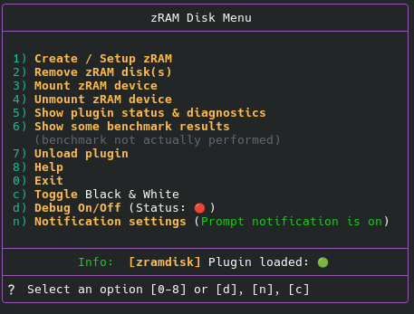
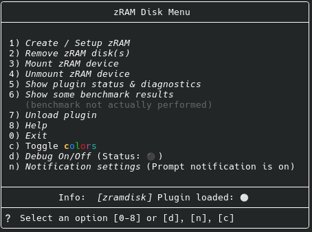

# zramdisk

## Einführung

### Benutzerfreundliche Konfiguration, Erstellung, Einbindung, Ausbindung und Verwaltung eines komprimierten RAM-Laufwerks (zram).

- 🎛️ **Einfache Handhabung** – geführte Installation und Bedienung
- 🧩 **Modulare Struktur** – daher hat das Plugin einen **sehr geringen Overhead** (der benötigte Code wird nur bei Bedarf geladen)
- 🤖 **Kein Aufwand mit systemctl** – kein Daemon erforderlich
- 💾 **Anzeige nützlicher Informationen** – Initialisierungsstatus, verwendeter Komprimierungsalgorithmus, Mountpoint und mehr
- 📦 **Plugin-Manager-kompatibel** – funktioniert mit Zsh Unplugged, oh-my-zsh, zinit, antigen usw. (sollte mit jedem Zsh-Plugin-Manager funktionieren, der dem Zsh-Plugin-Standard entspricht)
- ✅ **Zsh-Plugin-Standard-konform**

---

<details><summary> 🚀 Schnellstart</summary>

#### 1. Schritt: Klonen

```zsh
% git clone https://github.com/Rorschach2/zramdisk ~/.config/zsh/plugins/zramdisk
```

#### 2. Schritt: Einbinden
```zsh
% source ~/.config/zsh/plugins/zramdisk/zramdisk.plugin.zsh
```
#### 3. Schritt: Aufrufen
```zsh
% zramdisk menu
```

Informationen zur Installation mit einem Plugin-Manager oder Framework Ihrer Wahl finden Sie im Abschnitt 🛠️ Installation.

</details>

---

<details><summary> 🔄 Alternativen </summary>

Neben diesem Plugin und der manuellen Installation gibt es einige alternative Methoden:

__Debian__
[Debian](https://wiki.debian.org/ZRam „Debian - zRAM“) bietet das Paket `zram-tools`, das seit Debian Buster verfügbar ist.
Es richtet derzeit nur zram-Geräte auf systemd-basierten Systemen ein. Um bis zu 60 % des RAM als komprimierten zstd-Swap-Speicher zu verwenden:
```zsh
% sudo apt install zram-tools
% echo -e "ALGO=zstd\nPERCENT=60" | sudo tee -a /etc/default/zramswap
% sudo service zramswap reload
```

Mehr dazu unter: [Debian - zRAM](https://wiki.debian.org/ZRam)

__Ubuntu__ (und Derivate)
Ubuntu-Benutzer sollten die Verwendung von `zram-config` in Betracht ziehen. Ich kann nicht beurteilen, ob dies einfacher zu handhaben ist, da ich weder Ubuntu noch eines seiner Derivate verwende.

Sie können es mit folgendem Befehl installieren:

zsh
% sudo apt-get install zram-config


Anschließend müssen Sie den Dienst mit folgenden Befehlen aktivieren:

zsh
% systemctl enable zram-config

% systemctl start zram-config


Arch Linux
Einige Arch-Distributionen, wie z. B. CachyOS, enthalten ein Programm namens `zram-generator`. Ich habe es ausprobiert und finde es nicht so benutzerfreundlich wie dieses Plugin. Lassen Sie sich aber gerne vom Gegenteil überzeugen. Der Vorteil von `zram-generator` ist, dass es möglicherweise bereits installiert ist. Der Nachteil ist, dass eine gründliche Vorstudie zur Funktionsweise von `zram-generator` notwendig erscheint und die Befolgung der Anweisungen nicht immer einfach ist. Ehrlich gesagt ist es aber nicht unmöglich. Vergessen Sie nicht, den Daemon zu aktivieren, sonst funktioniert es nicht.

</details>

---

## Einleitung

Es handelt sich hierbei nicht um eine Auslagerungsdatei, sondern um ein nutzbares temporäres Laufwerk für vom Benutzer initiierte Lese- und Schreibzugriffe. Das bedeutet, dass Daten aktiv darauf gespeichert werden können. Diese Daten gehen jedoch beim Beenden der Sitzung verloren – das liegt in der Natur der Sache.

Zum Vergleich: Wie aufwendig die manuelle Installation eines zRAM-Geräts ist, erfahren Sie unter [FOSSPOST.ORG – Enable Zram on Linux For Better System Performance](https://fosspost.org/enable-zram-on-linux-better-system-performance).

Dieses Plugin aktiviert keine systemd-Dienste oder andere Daemons. Entsprechende Lösungen sind bereits verfügbar (siehe Abschnitt „Alternativen“ weiter unten).

|wichtiger Hinweis|
|-|
|_Eine zRAM-Disk wird nur dann im Speicher gehalten, wenn sie erstellt und eingebunden wird. Sie wird nicht automatisch beim Systemstart eingebunden._|
|**_Das Gerät, z. B. zram1, ist nicht mehr verfügbar, wenn das System aus irgendeinem Grund heruntergefahren wird. Wenn Sie das Gerät regelmäßig benötigen, sollten Sie einen Daemon oder Dienst verwenden, der mit den im Abschnitt „Alternativen“ beschriebenen Tools erstellt werden kann._**|

<details><summary> 🔄 Alternativen </summary>

Neben diesem Plugin und der manuellen Installation gibt es einige alternative Methoden:

__Debian__
[Debian](https://wiki.debian.org/ZRam „Debian - zRAM“) bietet das Paket `zram-tools`, das seit Debian Buster verfügbar ist.
Es richtet derzeit nur zram-Geräte auf systemd-basierten Systemen ein. Um bis zu 60 % des RAM als komprimierten zstd-Swap-Speicher zu verwenden:
```zsh
% sudo apt install zram-tools
% echo -e "ALGO=zstd\nPERCENT=60" | sudo tee -a /etc/default/zramswap
% sudo service zramswap reload
```

Mehr dazu unter: [Debian - zRAM](https://wiki.debian.org/ZRam)

__Ubuntu__ (und Derivate)
Ubuntu-Benutzer sollten die Verwendung von `zram-config` in Betracht ziehen. Ich kann nicht beurteilen, ob dies einfacher zu handhaben ist, da ich weder Ubuntu noch eines seiner Derivate verwende.

Sie können es mit folgendem Befehl installieren:

zsh
% sudo apt-get install zram-config


Anschließend müssen Sie den Dienst mit folgenden Befehlen aktivieren:

zsh
% systemctl enable zram-config

% systemctl start zram-config


Arch Linux
Einige Arch-Distributionen, wie z. B. CachyOS, enthalten ein Programm namens `zram-generator`. Ich habe es ausprobiert und finde es nicht so benutzerfreundlich wie dieses Plugin. Lassen Sie sich aber gerne vom Gegenteil überzeugen. Der Vorteil von `zram-generator` ist, dass es möglicherweise bereits installiert ist. Der Nachteil ist, dass eine gründliche Vorstudie zur Funktionsweise von `zram-generator` notwendig erscheint und die Befolgung der Anweisungen nicht immer einfach ist. Ehrlich gesagt ist es aber nicht unmöglich. Vergessen Sie nicht, den Daemon zu aktivieren, sonst funktioniert es nicht.

</details>

---

## Allgemeine Informationen

zRAM selbst benötigt in jedem Fall Arbeitsspeicher; laut Manpage belegt es selbst ohne installierte RAM-Disk einen kleinen Teil des installierten RAMs.

Der Vorteil dieses Plugins liegt darin, dass die (De-)Installation und (De-)Aktivierung eines zRAM-Laufwerks weitgehend menügesteuert und dabei so transparent wie möglich ablaufen. Dank des modularen Designs des Plugins wird der im Speicher gehaltene Code auf ein Minimum reduziert.

Viele Distributionen erstellen ohnehin eine Auslagerungsdatei mit zRAM, sodass zRAM immer aktiv ist. Daher erscheint der durch das Plugin benötigte zusätzliche RAM-Bedarf von einigen Kilobyte akzeptabel.

Grundkenntnisse von zRAM und `zramctl` sind in jedem Fall hilfreich.

## 🪄 Funktionsweise

Beim Start einer interaktiven Shell prüft das Plugin, ob alle benötigten Tools vorhanden sind, und zeigt eine Benachrichtigung an, falls welche fehlen. Sind nicht alle Tools vorhanden, wird das Plugin entladen.

Wenn alles in Ordnung ist, läuft das Plugin im Hintergrund, bis beispielsweise das Menü `zramdisk menu` aufgerufen wird. Bei Auswahl von `zRAM erstellen/einrichten` prüft das Plugin, ob eine Konfigurationsdatei (zramdisk.conf) vorhanden ist oder die Einrichtung bereits abgeschlossen wurde. Existiert eine Datei namens `zramdisk.conf`, geht das Plugin davon aus, dass die Einrichtung bereits abgeschlossen ist, und bietet an, die darin gespeicherte Konfiguration zu verwenden. Die Konfiguration wird Ihnen angezeigt, und Sie können entscheiden, ob Sie sie verwenden möchten.

| Hinweis |
|-|
Das Vorhandensein einer Konfigurationsdatei bedeutet nicht automatisch, dass ein entsprechendes Gerät existiert. zRAM-Geräte werden in der Regel beim Herunterfahren des Systems entfernt und müssen nach einem Neustart neu erstellt werden.|

Sie können Ihre zram-Geräte entweder über das Menü oder die Kommandozeile verwalten. (Siehe Abschnitt „Interaktives Menü“ weiter unten.)

In einigen Schritten werden Sie zur Eingabe des Administratorpassworts aufgefordert, da diese Aktionen erhöhte Berechtigungen erfordern, z. B. das Erstellen eines Dateisystems oder das Einbinden eines Geräts.

Während der Einrichtung werden Sie außerdem nach verschiedenen Parametern gefragt, wie z. B. der Größe der zu erstellenden zRAM-Disk und dem Komprimierungsalgorithmus. Sobald die Informationen erfasst wurden, wird die Disk erstellt. Kein Ausprobieren, keine Suche nach Anleitungen im Internet – geben Sie einfach Ihre gewünschten Einstellungen an, und das Plugin erledigt den Rest. Während des gesamten Prozesses werden Sie stets über die Einstellungen informiert, da diese nach jedem wichtigen Schritt angezeigt werden.

Der Aufruf von `zramdisk menu → Status` zeigt unter anderem alle vorhandenen und initialisierten Geräte an, einschließlich ihres Einbindungsstatus. Der zugehörige Mountpunkt wird ebenfalls angezeigt. Nicht initialisierte Geräte werden nicht angezeigt, da `zramctl`, das vom Plugin verwendete Tool, diese Informationen nicht bereitstellt. `zramdisk diagnose` liefert umfassendere Informationen, einschließlich Details zu nicht initialisierten Geräten. Verwenden Sie im Zweifelsfall diesen Befehl oder `zramdisk diag --dmsg` (für Kernel-Protokolle) bzw. `zramdisk --system` (für systemd-Einträge).

Bei erfolgreicher Einrichtung und Erstellung eines zRAM-Geräts wird im Plugin-Verzeichnis eine Markierungsdatei (zramdisk.conf) angelegt. Das Plugin verwendet das Vorhandensein dieser Datei, um festzustellen, ob die Einrichtung abgeschlossen wurde. Die Datei enthält Konfigurationsinformationen des zRAM-Geräts. Änderungen an dieser Datei haben keine Auswirkungen auf ein aktives zRAM-Gerät.

Zusätzlich können Sie eine kurze Benachrichtigung aktivieren (entweder als Eingabeaufforderung oder als Desktop-Benachrichtigung), die anzeigt, dass das Plugin aktiv und zRAM verfügbar ist. Dies wurde implementiert, da das Plugin sonst kaum sichtbar wäre. Sie können die für Ihre Bedürfnisse passende Variante bedenkenlos ausprobieren, da die Einstellung unaufdringlich und jederzeit rückgängig zu machen ist.

Standardmäßig wird das zRAM-Gerät unter `$HOME/zramdisk` eingebunden. Dieses Verzeichnis wurde aus Gründen der Übersichtlichkeit gewählt, sodass Sie das Verzeichnis jederzeit einsehen können, ohne in versteckten oder schwer auffindbaren Verzeichnissen wie `$HOME/.cache`, `/var/tmp` usw. suchen zu müssen. Sie können den Standard-Mountpunkt nur durch Bearbeiten des Plugin-Codes ändern, wobei nur wenige Einschränkungen gelten. Beispielsweise ist es nicht ratsam, den Mountpunkt im Root-Verzeichnis oder einem anderen Verzeichnis mit eingeschränktem Zugriff zu platzieren. Das sollte eigentlich selbstverständlich sein, aber ich erwähne es sicherheitshalber noch einmal.

Wenn Sie Änderungen vornehmen oder ein neues oder zusätzliches Gerät erstellen möchten, können Sie dies über das Menü tun. Geben Sie einfach den Befehl `zramdisk menu` ein. Dadurch wird das Menü mit verschiedenen Optionen geöffnet. Siehe auch den Abschnitt „Interaktives Menü“ in diesem Dokument. Die meisten Aktionen sind mit wenigen Tastendrücken erreichbar.

Bitte beachten Sie, dass die Konfigurationsdatei nur die zuletzt verwendeten Einstellungen speichert. Die Möglichkeit, Einstellungen für mehrere Geräte zu speichern, wird möglicherweise in zukünftigen Versionen implementiert.

Das RAM-Laufwerk bleibt auch bei geschlossenem Terminal zugänglich und existiert bis zum Herunterfahren des Systems. Dadurch kann es auch in Desktop-Umgebungen ohne Terminal verwendet werden. Um das Laufwerk nach dem Aushängen wieder zu aktivieren, können Sie entweder das Plugin-Menü mit `zramdisk menu` aufrufen und die Option `mount` auswählen oder direkt über die Kommandozeile mit `zramdisk mount` einbinden. Ganz einfach.

__Aber noch einmal: Das Gerät (/dev/zramX) ist nach dem Herunterfahren des Systems – aus welchem ​​Grund auch immer – nicht mehr vorhanden.__

<details><summary> 🧠 Warum ist kein Daemon erforderlich? </summary>

Das zRAM-Subsystem ist direkt in den Kernel integriert – das heißt, alles geschieht dort, wo Linux seine Prozesse ausführt.

Wenn das Plugin also ein Gerät erstellt, kommuniziert es direkt mit dem Kernel.

Das bedeutet:

- kein zusätzlicher Daemon
- keine systemd-Unit
- keine weiteren unnötigen Komponenten
- reine Kernel-Leistung

Kurz gesagt: Das Plugin kommuniziert direkt mit dem Kernel, nicht mit Praktikanten.


</details>

---

## 📝 Voraussetzungen

<details><summary>GNU/Linux-Kernel (>3.14); Z Shell (>5.4.2) ← hier klicken für weitere Informationen</summary>

_Das Plugin funktioniert möglicherweise unter macOS und BSD, wurde aber auf diesen Plattformen nicht getestet. Falls Sie Informationen oder Feedback haben, hinterlassen Sie bitte einen Kommentar oder erstellen Sie einen Pull Request, wenn Sie eine Idee zur Codeverbesserung haben._

Um Ihre Kernel-Version manuell zu überprüfen, führen Sie folgenden Befehl in der Kommandozeile aus:

```zsh
% uname -v
```

Heutzutage sollte niemand mehr eine Kernel-Version <3.14 verwenden, es sei denn, Sie nutzen einen Rechner mit einem 80286-Prozessor oder älter. In diesem Fall ist ein zRAM-Laufwerk jedoch nicht sinnvoll.

Bezüglich der Z Shell sollte jede Version ab 5.5 ausreichen. Sie können Ihre Version mit folgendem Befehl überprüfen:

```zsh
% echo $ZSH_VERSION
```

Bei Z Shell-Versionen ≤ 5.5 gibt das Plugin eine Fehlermeldung aus und lässt sich nicht laden.

</details>

<details><summary>Tools: GNU Core Utilities ← hier klicken für Details</summary>

Das Plugin prüft, ob die folgenden Tools vorhanden sind. Fehlen einige davon, informiert das Plugin den Benutzer und beendet sich selbst.

|Tool|Zweck|
|-|-|
|GNU Core Utilities | Eine Sammlung von GNU-Software, die viele Standard-Shell-Befehle auf Unix-Basis implementiert |
| awk | Berechnet z. B. die Standardgröße des zu erstellenden zRAM-Geräts |
| grep | Gibt Zeilen aus, die bestimmten Mustern entsprechen |
| mount | Gerät einbinden |
| mountpoint | Prüfen, ob ein Verzeichnis ein Mountpunkt ist |
| sed | Stream-Editor (daher der Name) zum Filtern und Transformieren von Text |
| sudo | Erforderliche erhöhte Benutzerrechte (privilegierte Rechte) erlangen |
| umount | Gerät aushängen |
| zramctl | Teil des util-linux-Pakets – zram-Geräte einrichten und steuern |

Ob das System die notwendigen Tools bereitstellt, lässt sich auch mit dem Befehl `which` ermitteln, z. B. `which zramctl`. Die Ausgabe sollte `/usr/bin/zramctl` sein, falls zramctl installiert ist. Allerdings werden all diese Tools von fast allen Linux-Distributionen bereitgestellt – möglicherweise nicht von TempleOS.

Es gibt mehrere Möglichkeiten herauszufinden, ob zRAM auf Ihrem System aktiviert ist, zum Beispiel:

`cat /proc/swaps` liefert einige Informationen wie diese:

```zsh
% cat /proc/swaps
Dateiname Typ Größe Belegt Priorität
/dev/zram0 Partition 65698812 1240 100
```

zramctl erzeugt eine andere und etwas ausführlichere Ausgabe:

```zsh
% zramctl
NAME ALGORITHMUS FESTPLATTE DATENKOMPRIMATOR GESAMT STREAMS MOUNTPOINT
/dev/zram0 zstd 62,7G 1M 151K 1M [SWAP]
```

Mit der Option `--output-all` ist die Ausgabe noch ausführlicher:

```zsh
% zramctl --output-all
NAME FESTPLATTE DATENKOMPRIMATOR ALGORITHMUS STREAMS ZERO-PAGES GESAMT SPEICHERLIMIT SPEICHERVERBRAUCH MIGRATIERT KOMPATIBILITÄT MOUNTPOINT
/dev/zram0 62,7G 332K 63,5K zstd 0 808K 0B 1,6M 0B 0,4109 [SWAP]


Lassen Sie sich jedoch nicht von den hier angegebenen Festplattengrößen täuschen. Diese zeigen im Wesentlichen die mögliche, nicht die tatsächliche Größe an. Außerdem werden von zramctl nur initialisierte Geräte angezeigt.

Leider zeigt `zramctl` keine Mountpoints für andere zRAM-Geräte als Swap-Geräte an. Falls Sie diese Information benötigen, können Sie folgenden Workaround verwenden:

```zsh
cat /proc/self/mountinfo | grep zram | awk '{print $5}'
```

Das Plugin verwendet diese Zeile im Skript `zramdisk_diag`, um festzustellen, ob ein vorhandenes und initialisiertes zRAM-Gerät gemountet ist, und zeigt den entsprechenden Mountpoint an.

</details>

---
## 🛠️ Installation

<details><summary>Manueller Aufruf über die Kommandozeile</summary>

#### 1. Schritt: Klonen

```zsh
% git clone https://github.com/Rorschach2 /zramdisk ~/.config/zsh/plugins/zramdisk
```

#### 2. Schritt: Laden
```zsh
% source ~/.config/zsh/plugins/zramdisk/zramdisk.plugin.zsh
```

#### 3. Schritt: Aufrufen
```zsh
% zramdisk
```

um eine Hilfeseite anzuzeigen, oder

```zsh
% zramdisk menu
```

um das Menü für die interaktive Nutzung aufzurufen.

</details>

### Verwendung von Plugin-Managern

<details><summary> ZSH Unplugged</summary>

Fügen Sie Folgendes zu Ihrer `.zshrc` hinzu:

```zsh
# Verwenden Sie die folgenden 15 Zeilen nicht zusammen mit anderen Plugin-Managern!
# Wenn Sie ZSH Unplugged bereits verwenden, können Sie diesen Teil überspringen <------------------------------------------------------------------------------------>
# Zsh Unplugged starten
#
# Wo speichern Sie Ihre Plugins?
ZPLUGINDIR=$HOME/.config/zsh/plugins
#
# Laden Sie zsh_unplugged herunter, speichern Sie es zusammen mit Ihren anderen Plugins und laden Sie es.
if [[ ! -d $ZPLUGINDIR/zsh_unplugged ]]; then
git clone --quiet https://github.com/mattmc3/zsh_unplugged $ZPLUGINDIR/zsh_unplugged
fi
source $ZPLUGINDIR/zsh_unplugged/zsh_unplugged.zsh
#
# fpath erweitern und zsh-defer laden
fpath+=($ZPLUGINDIR/zsh-defer)
autoload -Uz zsh-defer
#
<------------------------------------------------------------------------------------>
```

Erweitern oder erstellen Sie anschließend eine Liste der verwendeten Zsh-Plugins (beachten Sie die Ladefolge).

```
repos=(
# ... Ihre anderen Plugins ...
TomfromBerlin/zramdisk
)
```

Falls noch nicht geschehen, fügen Sie den folgenden Codeblock vor (!) `autoload -Uz promptinit && promptinit` ein:

```
# compinit anpassen
alias compinit='compinit-tweak'
compinit-tweak() { grep -q "ZPLUGINDIR/*/*" <<< "${@}" && \compinit "${@}"
}
# Jetzt Plugins laden
plugin-load $repos
# Zsh Uplugged Ende

```

💡 Empfehlung: Platzieren Sie den dritten Codeblock direkt vor Ihren Prompt-Definitionen und – wie bereits erwähnt – zwingend vor `autoload -Uz promptinit && promptinit`.

</details>

<details><summary>Antigen</summary>

Fügen Sie Folgendes zu Ihrer .zshrc-Datei hinzu:

```zsh
antigen bundle TomfromBerlin/zramdisk
```

</details>

<details><summary>Oh-My-Zsh</summary>

Geben Sie den folgenden Befehl in der Kommandozeile ein und bestätigen Sie mit der Eingabetaste:

```zsh
% git clone https://github.com/TomfromBerlin/zramdisk ${ZSH_CUSTOM:-~/.oh-my-zsh/custom}/plugins/zramdisk
```

Fügen Sie anschließend Folgendes zu Ihrer .zshrc-Datei hinzu:

```zsh
plugins=(... zramdisk)
```

</details>

<details><summary>Zinit</summary>

Fügen Sie Folgendes zu Ihrer .zshrc-Datei hinzu:

```zsh
zinit light TomfromBerlin/zramdisk

```

</details>

Sie können das Plugin auch mit anderen Plugin-Managern laden.


⚠️ **Unabhängig vom verwendeten Plugin-Manager kann das Plugin mit anderen Plugins, die zramctl und/oder zRAM verwenden, in Konflikt geraten. ⚠️**

---

## 🧹 Deinstallieren

<details><summary> ← Hier klicken</summary>

Sie können das Plugin mit `zramdisk unload` entladen. Dadurch wird das Plugin entfernt, bis Sie Ihre Terminal-Sitzung neu starten.

Deaktivierung (keine Deinstallation: Entfernen Sie einfach den Plugin-Eintrag aus Ihrer Plugin-Liste und starten Sie dann Zsh mit `exec zsh` neu oder starten Sie eine neue Terminal-Session.

### Vollständige Entfernung:

```zsh
% zramdisk unload
% rm -rf ~/.config/zsh/plugins/zramdisk
% sed -i '/zramdisk/s/^/# /' ~/.zshrc # Die Zeile wird mit diesem Befehl nur auskommentiert.

```

Wenn Sie das `#` später entfernen, ist das Plugin wieder verfügbar, da (alle?) Plugin-Manager das Plugin automatisch von GitHub klonen.

</details>

---

## 🔘 Interaktives Menü

<details><summary> ← Hier klicken</summary>

Farbmodus



S/W-Modus



Drücken Sie einfach die entsprechende Taste, um die Funktion sofort aufzurufen. Eine Bestätigung mit Enter ist nicht erforderlich.

Alternativ können die meisten Funktionen auch direkt über die Kommandozeile aufgerufen werden (siehe nächster Abschnitt).

</details>

---

## ⌨️ Verfügbare Befehle

<details><summary> ← Hier klicken</summary>
Verwendung: `zramdisk` gefolgt von einem der unten stehenden Argumente

| Argument | Funktion |
|-|-|
| menu | Interaktives Menü |
| setup | zRAM-Gerät erstellen und einbinden |
| remove | Einhängepunkt und Gerät entfernen |
| on/mount | zRAM-Disk mit aktuellen Einstellungen einbinden |
| off/u[n]mount | zRAM-Disk aushängen |
| status | Plugin-Status anzeigen |
| diag | Diagnose mit formatierter Ausgabe |
| diag --kernel / --system | Zusätzliche Informationen anzeigen (Kernel-Logs, systemd-Einträge)
| diagnose | Ausführliche Diagnose (reiner Text) |
| bench/test | Benchmark-Ergebnisse anzeigen (nicht tatsächlich durchgeführt) |
| debug on/off | Debug-Modus ein-/ausschalten |
| unload | Plugin entladen |
| help | Diese Hilfe anzeigen |
| error | Anzeige einer Liste möglicher Fehler und ihrer Ursachen |
| trouble | Tipps zur Fehleranalyse und -behebung anzeigen |

|Hinweis 1|
|-|
|Wird das Plugin ohne Argumente aufgerufen (`% zramdisk`), werden verfügbare Befehlen angezeigt. Dies signalisiert, dass das Plugin geladen und betriebsbereits ist. Das Menü öffnet sich **nicht** automatisch bei jedem Shell-Start. Es ist möglich, sie eine Benachrichtigung (über der Eingabeaufforderung oder als Desktop-Benachrichtigung) anzeigen zu lassen, die Sie daran erinnert, dass zramdisk aktiv und einsatzbereit ist. Dazu muss im Menü die Taste "n" gedrückt werden. Danach kann die Art der Benachrichtigung festgelegt werden.|

|Hinweis 2|
|-|
|Gelegentlich (wenn mehrere zRAM-Geräte mit einer ID > 0 vorhanden sind) muss der Entfernungsprozess möglicherweise mehrmals durchgeführt werden, um alle Geräte zu entfernen. Ich empfehle die Verwendung des zramdisk-Menüs. Seien Sie vorsichtig mit `zramctl reset <Gerät>`, da Sie versehentlich Geräte entfernen könnten, z. B. in einer Docker-Umgebung.|

</details>

---

## 🈸 Verwendung der Kommandozeile

<details><summary> ← hier klicken</summary>
Alle wichtigen Funktionen können über die Kommandozeile aufgerufen werden, z. B.:

```
# Plugin laden
# Normalerweise in der zshrc-Datei
# Das Plugin kann manuell mit folgendem Befehl geladen werden. Gegebenenfalls muss der Pfad angepasst werden:

source ~$HOME/.config/zsh/plugins/zramdisk/zramdisk.plugin.zsh

# Status prüfen
zramdisk diag
zramdisk diag --service
zramdisk diag --dmsg
zramdisk diagnose

# Interaktives Menü
zramdisk menu

# Debug-Modus aktivieren
zramdisk debug on

# Debug-Modus deaktivieren
zramdisk debug off

# Gerät einhängen
zramdisk on|mount

# Gerät aushängen
zramdisk off|unmount|umount

# Gerät entfernen
zramdisk Entfernen

# Entladen des Plugins selbst: zramdisk unload

# Hilfe
zramdisk help

```
</details>

---

## 🎚️ Konfigurationsvariablen

<details><summary> ← hier klicken</summary>

|Variable| Standardwert | Beschreibung |
|-|-|-|
| `ZRAMDISK_SIZE` | 25 % des installierten RAM | Größe der zRAM-Disk |
| `ZRAMDISK_COMP_ALG` | zstd | Komprimierungsalgorithmus (zstd, lz4, lzo, ...) |
| `ZRAMDISK_DIR` | `${HOME}/zramdisk` | Mountpunkt |
| `ZRAMDISK_DEBUG` | 0 | Debug-Modus: 0 = aus, 1 = ein |

Die Konfiguration wird in die Datei `zramdisk.conf` im Plugin-Verzeichnis geschrieben und enthält zusätzliche Informationen. Sie ist lesbar und kann manuell bearbeitet werden, wenn Sie wissen, was Sie tun. Wenn die Datei beschädigt ist oder ihr Inhalt bedeutungslos ist, löschen Sie sie einfach und führen Sie die Installation erneut aus.

</details>

---

## 🌳 **Verzeichnisstruktur**

<details><summary>← mit einer kurzen Funktionsbeschreibung</summary>

```zsh
.zsh-zramdisk/─╮ → Basisverzeichnis
| ├── LIZENZ
| ├── README.md → diese Datei
│ ├── zramdisk.conf → existiert nur, wenn die Einrichtung durchgeführt wurde
│ ├── zramdisk.plugin.zsh
│ ╰── zramdisk.zsh
├──functions/─╮ → Verzeichnis der Moduldateien
│             ├── zramdisk_animtex → animiert Textstrings (nur zum Spaß)
│             ├── zramdisk_benchmark → Komprimierungs-Benchmark (nur zur Information)
│             ├── zramdisk_cleanup → bereinigt die Umgebung beim Entladen des Plugins
│             ├── zramdisk_config_found
│             ├── zramdisk_create → Erstellung vorbereiten
│             ├── zramdisk_create_disk → ZRAM-Gerät erstellen
│             ├── zramdisk_current_choice → Aktuelle Einstellungen während der Einrichtung anzeigen
│             ├── zramdisk_debug → Debug-Modus aktivieren/deaktivieren
│             ├── zramdisk_determine_device
│             ├── zramdisk_determine_mountpoint
│             ├── zramdisk_diag → zeigt eine kurze Diagnose an
│             ├── zramdisk_diagnose → erweiterte Diagnose als reiner Text
│             ├── zramdisk_error_list → Mögliche Fehler und deren Ursache
│             ├── zramdisk_find_unmounted_zram
│             ├── zramdisk_notify → Benachrichtigung, falls notwendige Tools fehlen
│             ├── zramdisk_notify_me → Optionale Benachrichtigung beim Laden des Plugins
│             ├── zramdisk_perform_mount → zRAM-Gerät einbinden
│             ├── zramdisk_plugin_unload → entladen des Plugins
│             ├── zramdisk_prepare_mount → Vorbereitung zum Einbinden des zRAM-Geräts
│             ├── zramdisk_remove → zRAM-Gerät entfernen
│             ├── zramdisk_select_alg → Komprimierungsalgorithmus auswählen
│             ├── zramdisk_select_existing_device
│             ├── zramdisk_setup → Start für die Einrichtng eines zRAM-Laufwerkes
│             ├── zramdisk_size → Festplattengröße festlegen
│             ├── zramdisk_troubleshooting → Detaillierte Fehlerbehebung
│             ├── zramdisk_ui → Benutzeroberfläche
│             ├── zramdisk_umount → Aushängen eines zRAM-Laufwerkes
│             ├── zramdisk_validate_device
│             ├── zramdisk_write_config → aktuelle Konfiguration speichern
│             ├── zramdisk_wrong_zsh_version → ZSH Version prüfen
│             ├── zramdisk_zram_available → Prüfen, ob das Kernelmodul verfügbar ist
│             ╰── zramdisk_zramctl_missing → Prüfen, ob zramctl verfügbar ist
╰── icons/─╮
           ╰── dialog-warn.png

```

Es können Markierungsdateien wie `notification_p`, `notification_d` oder `color` vorhanden sein, die die Benutzerbenachrichtigung über den Plugin-Status oder das Erscheinungsbild des Plugins (Farben vs. keine Farben) beeinflussen.

</details>

---

## ⚖️ Haftungsausschluss

<details><summary> ← hier klicken</summary>

Zunächst einmal ist Folgendes klarzustellen: Obwohl dieses Plugin mit größter Sorgfalt entwickelt und gründlich getestet wurde, besteht immer ein Restrisiko für Datenverlust. Es handelt sich um ein temporäres Laufwerk, auf dem Daten vorübergehend gespeichert werden können. „Temporär“ bedeutet, dass alle auf diesem Laufwerk gespeicherten Daten verloren gehen, wenn das System – ob absichtlich oder unabsichtlich – heruntergefahren wird oder aufgrund eines Stromausfalls ausfällt. Das Zurückschreiben (Datensicherung auf eine Festplatte) wird nicht unterstützt; hierfür stehen andere Lösungen zur Verfügung.

Im Falle eines Datenverlusts übernimmt der Anbieter dieses Plugins (ich) unter keinen Umständen die Haftung.

Dieses Plugin funktioniert nicht auf allen Distributionen. Debian stellt beispielsweise das notwendige Tool `zramctl` nicht bereit. Es funktioniert auf CachyOS, Ubuntu, Fedora und Linux Mint. Andere Distributionen müssen getestet werden.
Die Padding-Funktion funktioniert nicht in allen Terminals gleich gut. Die Menüs des Plugins sehen beispielsweise im System67-Terminal (unter Pop!OS) wirklich unschön aus. Ich empfehle die Verwendung eines anderen Terminals, wie z. B. Gnome Terminal oder Konsole. Ich werde weitere Terminals testen, sobald ich Zeit habe.

</details>