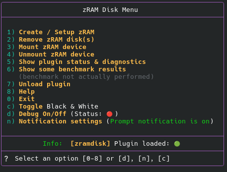
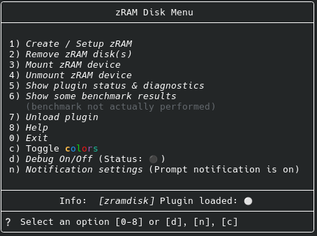

<p align="center">
  
  
  
  
  
  
  
  
  
</p>

# zramdisk

|Disclaimer:|
|-|
|First and foremost, the following should be clarified: Although this plugin was created with the utmost care and thoroughly tested, there is always a residual risk of data loss. We are talking about a temporary drive on which data can be temporarily stored. "Temporary" means that if the system is shut down —intentionally or unintentionally— or fails due to a power outage, all data stored on this drive will be lost. Write-back (data backup to a hard drive) is not supported; other solutions are available for this.|
|In the event of data loss, the provider of this plugin (me) cannot be held liable under any circumstances.|
|This plugin will not work on all distributions, e.g. Debian does not provide the nessecary tool `zramctl`. It works on CachyOS, Ubuntu, Fedora and LinuxMint. Other distributions have to be tested. |
|The padding doesn't work equally well in all terminals. For example, the plugin's menus look really ugly in the System67 terminal (on Pop!OS). I recommend using a different terminal, such as Gnome Terminal or Konsole. I'll test more terminals when I have the time.|

## Introduction

### Userfriendly configuration, creation, mounting, unmounting, and management of a compressed RAM disk.

We are not talking about a swap file, but a usable temporary drive for user-initiated read and write access. This means that data can be actively stored on it. However, this data is lost when the session ends, but that's simply the nature of the thing.

For comparison, you can see how much effort is involved in manually installing a zRAM device at [FOSSPOST.ORG - Enable Zram on Linux For Better System Performance](https://fosspost.org/enable-zram-on-linux-better-system-performance "Enable Zram on Linux For Better System Performance").

This plugin does not activate any systemd services or other daemons. These solutions already exist (see the Alternatives section below).

| Notes |
|-|
| _A zRAM disk is only kept in memory when it is created and mounted. No automatic mounting at shell startup._ |
| **_The device, e.g., zram1, becomes unavailable if the system is shut down for any reason. If you need the device regularly, you should consider using a daemon or service, which can be created using the tools described in the "Alternatives" section._** |

#
<details><summary> 🔄 Alternatives </summary>
Beside this plugin and manual installation some alternative methods exist:

__Debian__  
[Debian](https://wiki.debian.org/ZRam "Debian - zRAM") provides the package `zram-tools`, that is available since Debian buster.  
It currently only sets up zram devices on systemd-based systems.  
To allow up to 60% of the RAM to be used as a zstd compressed swap space:
```zsh
% sudo apt install zram-tools
% echo -e "ALGO=zstd\nPERCENT=60" | sudo tee -a /etc/default/zramswap
% sudo service zramswap reload
```

More under: [Debian - zRAM](https://wiki.debian.org/ZRam)

__Ubuntu__ (and derivates)  
Ubuntu users should consider using `zram-config`. I can't judge whether this is easier to use, as I don't use Ubuntu or any of its derivatives.
You can install it with
```zsh
% sudo apt-get install zram-config
```

Afterwards you have to enable the service through the following commands:

```zsh
% systemctl enable zram-config
% systemctl start zram-config
```

__Arch Linux__  
Some Arch distributions, like CachyOS, include a program called `zram-generator`. I've tried it, and in my opinion, it's not as user-friendly as this plugin, but prove me wrong. The advantage of `zram-generator` is that it might already be installed. The disadvantage is that a thorough preliminary study of how `zram-generator` works seems necessary, and following the instructions isn't always easy. However, to be honest, it's not impossible. Don't forget to enable the daemon or it won't work at all.

</details>

<details><summary> 🚀 Quick Start</summary>
 
#### 1st step: clone it

```zsh
% git clone https://github.com/Rorschach2/zramdisk ~/.config/zsh/plugins/zramdisk
```

#### 2nd step: source it
```zsh
% source ~/.config/zsh/plugins/zramdisk/zramdisk.plugin.zsh
```
#### 3rd step: call it
```zsh
% zramdisk menu
```

For installation with a plugin manager or framework of your choice, see the 🛠️ Install section.

</details>

---

## ✨ Features

- 🎛️ **Easy handling** - guided installation and operation
- 🧩 **Modular structure** - therefore the plugin has **very low overhead** (the required code is only loaded when needed)
- 🤖 **No hassle with systemctl** - no daemon necessary
- 💾 **Display of useful information** - initialization status, used compression algorithm, mountpoint and more
- 📦 **Plugin Manager Ready** - works with Zsh Unplugged ,oh-my-zsh, zinit, antigen, etc. (should work with every zsh plugin manager that follows the Zsh Plugin Standard)
- ✅ **Zsh Plugin Standard compliant**

---
## General Information

zRAM itself consumes memory in any case; according to the man page, even without a RAM disk installed, it uses a small amount of the installed RAM.

The advantage of this plugin is that the (un)installation and (de)activation of a zRAM drive are more or less menu-driven, while remaining as transparent as possible. Due to the plugin's modular design, the amount of code held in memory is kept to a minimum.

It's worth noting that many distributions create a swap file using zRAM anyway, meaning zRAM is active regardless. Therefore, the trade-off of a few extra kilobytes of RAM required by the plugin seems acceptable.

Basic knowledge of zRAM and `zramctl` is helpful in any case.

## 🪄 How It Works

When an interactive shell starts, the plugin checks if all necessary tools are present and displays a notification if any are missing. If not all tools are present, the plugin is unloaded.

If everything is fine, the plugin is happy and lurks in the background until, e.g., `zramdisk menu` is called. If you select `Create / Setup zRAM` it checks if a configuration file (zramdisk.conf) is present or if the setup has already been completed. If a file named `zramdisk.conf` exists, the plugin assumes the setup process is already complete and offers to use the configuration stored in that file. For your convenience, the configuration is displayed, and you can decide whether to use it.

| Note |
|-|
| The presence of a configuration file does not automatically mean that a corresponding device exists. zRAM devices are generally removed upon system shutdown and must be recreated after a system restart. |

You can manage your zram devices either via the menu or the command line. (See the "Interactive Menu" section below.)

In some steps you will be prompted to enter the administrator password, as these actions require elevated privileges, e.g., creating a file system, mounting a device, etc.

During setup, you'll be also prompted for various parameters, such as the size of the zRAM disk to be created and the compression algorithm. Once the information has been gathered, the disk is created. No trial and error, no searching the internet for instructions – simply specify what you want, and the plugin takes care of the rest. During the whole process you will always be informed about the settings, as they are shown after every important step.

Accessing `zramdisk menu → Status` displays, among other useful information, any existing and initialized devices, including whether they are mounted or not. The corresponding mount point is also shown. Uninitialized devices are not displayed because `zramctl`, the tool the plugin uses, does not provide this information. `zramdisk diagnose` provides more comprehensive information, including details about uninitialized devices. If in doubt, use this command or `zramdisk diag --dmsg` (for kernel logs) or `zramdisk --system` (for systemd entries).

If the setup is successful and a zRAM device is created, a marker file (zramdisk.conf) is created in the plugin directory. The plugin uses the presence of this file to determine whether the setup was completed. The file contains config information of the zram device. Editing this file will not affect an active zRAM device.

Additionally, you can activate a brief notification (whether as a prompt notification or as a desktop environment notification) to be displayed indicating that the plugin is active and zRAM is available. This was implemented because otherwise the plugin would be barely visible. You can try out which variant suits your needs without hesitation, as the setting is non-intrusive and reversible at any time.

By default, the zRAM device is mounted under `$HOME/zramdisk`. This directory was chosen for transparency, so that you can view the directory at any time without having to dig in hidden or hard-to-find directories such as `$HOME/.cache`, `/var/tmp`, etc. You can change the default mount point only by editing the code of the plugin, and there are only a few restrictions. For example, it's not a good idea to place the mountpoint in the root directory or any other directory with restricted access. That should be obvious, but I'm mentioning it again just in case... Right? Layer 8?

If you want to make changes or create a new or additional device, you can do so via the menu. Simply enter the command `zramdisk menu`. This will launch the menu, which offers various options. See also the "Interactive Menu" section in this document. Most actions are just a few keystrokes away.

Please note that the configuration file only saves the most recent settings. The ability to save settings for multiple devices may be implemented in future versions.

The RAM drive remains accessible even when the terminal is closed and continues to exist until the system is shut down. This means it can also be used in desktop environments without a terminal. To reactivate the drive after unmounting, you can either access the plugin menu with `zramdisk menu` and select the `mount` option, or directly from the command line with `zramdisk mount`. Easy peasy.

__But again: The device (/dev/zramX) is gone as soon as the system shuts down for any reason.__

<details><summary> 🧠 Why is there no need for a daemon? </summary>

The zRAM subsystem is integrated directly into the kernel – meaning everything that happens happens right there where Linux does its thing.

So when the plugin creates a device, it talks directly to the kernel.

This means:
- no extra daemon
- no systemd unit
- no other unnecessary stuff
- just pure kernel power

In short: The plugin talks to the boss, not some interns.

</details>

---

## 📝 Requirements

<details><summary>GNU/Linux Kernel (>3.14); Z Shell (>5.4.2) ← click here for more info</summary>

_The plugin might work on macOS and BSD, but it hasn't been tested on those platforms. If anyone has information or feedback, please leave a comment or even a pull request, if you have an idea to improve the code._


To manually check your kernel version, run the following command at the command line:

  ```zsh
% uname -v
  ```

These days, no one should be using kernel version <3.14 unless you're running a machine with an 80286 processor or older. But then a zRAM drive doesn't make sense.

Regarding Z Shell, any version higher than 5.5 should suffice. You can check your version with:

```zsh
% echo $ZSH_VERSION
```

With Z Shell version ≤5.5 the plugin throws a desktop message and simply will not load.

</details>
 
<details><summary>Tools: GNU core utilities, awk, grep, mount, mountpoint, sed, sudo, umount, zramctl (click for details)</summary>

The plugin will check for the presence of the following tools. If some of them are missing, the plugin will inform the user and unload itself.

|Tool|Purpose|
|-|-|
|GNU core utilities | a collection of GNU software that implements many standard, Unix-based shell commands |
| awk | calculating, e.g. the default size of the zRAM device to be created |
| grep | print lines that match patterns |
| mount | mount a device |
| mountpoint | check if a directory is a mount point |
| sed | **s**tream **ed**itor (hence the name) for filtering and transforming text |
| sudo | get required elevated (privileged) user rights |
| umount | unmount a device |
| zramctl | part of the util-linux package - set up and control zram devices |

Whether the system provides the necessary tools can also be determined using the `which` command, e.g., `which zramctl`, which should return `/usr/bin/zramctl` if zramctl is installed. However, all these tools are provided by almost all Linux distributions – perhaps not by TempleOS.

There are several ways to find out if zRAM is enabled on your system, for example::

`cat /proc/swaps` gives few information like this:

```zsh
% cat /proc/swaps
Filename            Type            Size          Used        Priority
/dev/zram0          partition       65698812      1240        100
``` 

zramctl produces a different output and is somewhat more verbose:

```zsh
% zramctl
NAME          ALGORITHM   DISKSIZE   DATA   COMPR   TOTAL   STREAMS   MOUNTPOINT
/dev/zram0    zstd           62,7G     1M    151K      1M             [SWAP]
```

with the `--output-all` option, it is even more verbose:

```zsh
% zramctl --output-all
NAME       DISKSIZE  DATA COMPR ALGORITHM STREAMS ZERO-PAGES TOTAL MEM-LIMIT MEM-USED MIGRATED COMP-RATIO MOUNTPOINT
/dev/zram0    62,7G  332K 63,5K zstd                       0  808K        0B     1,6M       0B     0,4109 [SWAP]
```

However, don't be misled by the disk size specifications here. These essentially show the possible size, not the actual size. Also, only initialized devices will be displayed by zramctl.

Unfortunately, `zramctl` does not show mount points for zRAM devices other than swap devices. You can use a workaround if you need that info:

```zsh
cat /proc/self/mountinfo | grep zram | awk '{print $5}'
```

The plugin uses this line in the `zramdisk_diag` script to determine if an existing and initialized zRAM device is mounted and displays the corresponding mount point.

</details>

---

## 🛠️ Install
<details><summary>manual call via command line</summary>

#### 1st step: clone it

```zsh
% git clone https://github.com/Rorschach2	/zramdisk ~/.config/zsh/plugins/zramdisk
```

#### 2nd step: source it
```zsh
% source ~/.config/zsh/plugins/zramdisk/zramdisk.plugin.zsh
```

#### 3rd step: call it
```zsh
% zramdisk
```

to display a help screen, or

```zsh 
% zramdisk menu
```

to call the menu for interactive use.

</details>

### When using plugin managers

<details><summary> ZSH Unplugged</summary>

Add to your `.zshrc`:

```zsh
# Do not use the following 15 lines along with other plugin managers!
# If you already use ZSH Unplugged you can spare this part <------------------------------------------------------------------------------------>
# Zsh Uplugged start
#
# where do you store your plugins?
ZPLUGINDIR=$HOME/.config/zsh/plugins
#
# get zsh_unplugged and store it with your other plugins and source it
if [[ ! -d $ZPLUGINDIR/zsh_unplugged ]]; then
  git clone --quiet https://github.com/mattmc3/zsh_unplugged $ZPLUGINDIR/zsh_unplugged
fi
source $ZPLUGINDIR/zsh_unplugged/zsh_unplugged.zsh
#
# extend fpath and load zsh-defer
fpath+=($ZPLUGINDIR/zsh-defer)
autoload -Uz zsh-defer
#
```

Then extend or make list of the Zsh plugins you use (Consider paying attention to the loading order)
```
repos=(
  # ... your other plugins ...
  TomfromBerlin/zramdisk
)
```

If not already done, insert the following code block before(!) `autoload -Uz promptinit && promptinit`

```
# tweak compinit
alias compinit='compinit-tweak'
compinit-tweak() {
grep -q "ZPLUGINDIR/*/*" <<< "${@}" && \compinit "${@}"
}
# now load plugins
plugin-load $repos
# Zsh Uplugged end
# <------------------------------------------------------------------------------------>
```

💡 Best practice: place the third code block right before your prompt definitions and - as already mentioned - mandatory before `autoload -Uz promptinit && promptinit`.

</details>

<details><summary>Antigen</summary>

add to your .zshrc:

```zsh
antigen bundle TomfromBerlin/zramdisk
```

</details>

<details><summary>Oh-My-Zsh</summary>

Enter the following command on the command line and confirm with Return

```zsh
% git clone https://github.com/TomfromBerlin/zramdisk ${ZSH_CUSTOM:-~/.oh-my-zsh/custom}/plugins/zramdisk
```

then add to your .zshrc:

```zsh
plugins=(... zramdisk)
```

</details>

<details><summary>Zinit</summary>

add to your .zshrc:

```zsh
zinit light TomfromBerlin/zramdisk
```

</details>

You can load the plugin with any other plugin managers as well.

⚠️ **Regardless of which plugin manager you use, the plugin may interfere with other plugins that use zramctl and/or zRAM. ⚠️**


## 🧹 Uninstall

<details><summary> ← click here</summary>

You can unload the plugin with `zramdisk unload`. This will unload the plugin, until you restart your terminal session.

Dirty uninstall: simply remove the plugin entry from your plugin list and restart Zsh with `exec zsh`.

### To completely remove:

```zsh
% zramdisk unload
% rm -rf ~/.config/zsh/plugins/zramdisk
% sed -i '/zramdisk/s/^/# /' ~/.zshrc # the line will only be commented out with this command
```

If you remove the `#` later, the plugin will be available again, as (all?) plugin managers automatically clone the plugin from GitHub.

</details>

---

## 🔘 Interactive Menu

<details><summary> ← click here</summary>

Color Mode



B/W Mode



Simply press the corresponding key and the function is called immediately. No need to confirm with Enter.

Alternatively, most functions can also be called directly via the command line, see next section.

</details>


## ⌨️ Available commands

<details><summary> ← click here</summary>
Usage: `zramdisk` followed by one of the arguments below

| Argument | Function |
|-|-|
| menu | interactive menu |
| setup | create & mount a zRAM device |
| remove | remove mountpoint & device |
| on/mount | mount zRAM disk with current settings |
| off/u[n]mount | unmount zRAM disk |
| status | show plugin status |
| diag | diagnostics, with some nice formatting |
| diag --kernel / --system | display additional info (kernel logs, systemd entries)
| diagnose | verbose diagnostics, pure text |
| bench/test | display benchmark results (not actually performed) |
| debug on/off | turn debug mode on/off |
| unload | unload plugin |
| help | display this help |
| error | display a list of possible errors and their cause |
| trouble | display some troubleshooting |
###
|Note 1|
|-|
| _Without an argument, the plugin only displays a message indicating that it is loaded and the list of available arguments. Then exits to the command prompt. The menu is **not** opened automatically every time the shell is started. This would be annoying._ |
###
|Note 2|
|-|
| Occasionally (when multiple zRAM devices with an ID > 0 are present),  to remove all devices the removing process may have to be performed multiple times (either with the command zramdsik remove or via the menu). It should remove all devices from `1..99`, but it cannot be guaranteed. |

</details>

## 🈸 Using the command line

<details><summary> ← click here</summary>
Every important functionality can be invoked using the command line, e.g.:

```
# Load plugin
# usually done within the zshrc-file
# you can load the plugin manually using the following command,
# adjust path if necessary:
source ~$HOME/.config/zsh/plugins/zramdisk/zramdisk.plugin.zsh

# Check status
zramdisk diag
zramdisk diag --service
zramdisk diag --dmsg
zramdisk diagnose

# Interactive menu
zramdisk menu

# Enable debug
zramdisk debug on

# Disable debug
zramdisk debug off

# Mount device
zramdisk on|mount

# Unmount device
zramdisk off|unmount|umount

# Remove device
zramdisk remove

# Unload the plugin itself
zramdisk unload

# Help
zramdisk help
```

</details>

---

## 🎚️ Configuration variables

<details><summary> ← click here</summary>

|Variable| Default | Description |
|-|-|-|
| `ZRAMDISK_SIZE` | 25% of installed RAM | Size of the zRAM disk |
| `ZRAMDISK_COMP_ALG` | zstd | Compression algorithm (zstd, lz4, lzo, ...) |
| `ZRAMDISK_DIR` | `${HOME}/zramdisk` | Mount point |
| `ZRAMDISK_DEBUG` | 0 | Debug mode: 0 = off, 1 = on |

The configuration is written to the `zramdisk.conf` file in the plugin directory and contains additional information. It is human-readable and can be edited manually if you know what you're doing. If the file is corrupted or its contents are meaningless, simply delete it and run the setup again.

</details>

---

## 🌳 **Directory structure**

<details><summary>← with a brief explanation of the functions</summary>

```zsh
.zsh-zramdisk/─╮               → base directory
|              ├── LICENSE
|              ├── README.md → this file
│              ├── zramdisk.conf → exists only if setup has been performed
│              ├── zramdisk.plugin.zsh
│              ╰── zramdisk.zsh
├──functions/─╮                → module files directory
│             ├── zramdisk_animtex → animates text strings (just for fun)
│             ├── zramdisk_benchmark → compression benchmark (info only)
│             ├── zramdisk_cleanup → clean env when plugin is unloaded
│             ├── zramdisk_config_found
│             ├── zramdisk_create → prepare creation
│             ├── zramdisk_create_disk → create zram device
│             ├── zramdisk_current_choice → displays the current settings during setup
│             ├── zramdisk_debug → turn on/off debug mode
│             ├── zramdisk_determine_device
│             ├── zramdisk_determine_mountpoint
│             ├── zramdisk_diag
│             ├── zramdisk_diagnose
│             ├── zramdisk_error_list → possible errors and their cause
│             ├── zramdisk_find_unmounted_zram
│             ├── zramdisk_notify → notification if some nessecary tools are missing
│             ├── zramdisk_notify_me → optional notification when plugin is loaded
│             ├── zramdisk_perform_mount → mount zRAM device
│             ├── zramdisk_plugin_unload
│             ├── zramdisk_prepare_mount → prepare to mount zRAM device
│             ├── zramdisk_remove → remove zRAM device
│             ├── zramdisk_select_alg → select compression algorithm
│             ├── zramdisk_select_existing_device
│             ├── zramdisk_setup
│             ├── zramdisk_size → define disk size
│             ├── zramdisk_troubleshooting → detailed troubleshooting
│             ├── zramdisk_ui → ui template
│             ├── zramdisk_umount
│             ├── zramdisk_validate_device
│             ├── zramdisk_write_config
│             ├── zramdisk_wrong_zsh_version → check ZSH version
│             ├── zramdisk_zram_available → check if kernel module is available
│             ╰── zramdisk_zramctl_missing → check if zramctl is available
╰── icons/─╮
           ╰── dialog-warn.png

```

There may be some marker files such as `notification_p`, `notification_d` or `no_color` that affect user notification about the plugin status or the plugin's appearance (colors vs. no colors).

</details>
